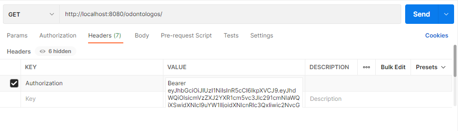

# Clínica Odontológica

El proyecto es una API REST de una clínica odontológica en proceso.

## Instalación
Una vez clonado el proyecto ejecutar el comando:
```bash
mvn clean install
```
## Consumo desde Postman

En el repositorio se encuentran los archivos: 
- odontologo.postman_collection.json
- pacientes.postman_collection.json
- token.postman_collection.json
- turno.postman_collection.json

1. Realizar la importación a Postman. 
2. Generar el token, me devolvera un objeto  
3. Copiar el valor del atributo `access_token`
4. En `Headers` de cada peticion de odontologo, pacientes y turnos pegar el valor del atributo `access_token` en value siempre conservando la palabra `Bearer` y como key `Authorization`:

5. Cada token tiene una duración de 30 min. 

## Consumo desde FrontEnd

Una vez que la aplicación backend esté corriendo y el repositorio [https://github.com/emelyvera/reserva-turnos-frontEnd](https://github.com/emelyvera/reserva-turnos-frontEnd) este clonado. 
Se podra realizar el consumo de la API REST.

#### Nota : El formato de fecha y hora en la registro de un turno se requiere ser enviado de la siguente manera: `2022-04-20T11:00:00.000` para ser recibido correctamente.


## Endpoints
### Odontólogos

- Registrar nuevo: `POST` a `http://localhost:8080/odontologos/`
    -  `200 OK` → se registró correctamente
    - `400 BAD REQUEST` → hubo un error en los datos recibidos
         ```json
           {
               "nombre": "Pepe",
               "apellido": "Perez",
               "matricula": 123
           }
         ```

- Obtener todos: `GET` a `http://localhost:8080/odontologos/`


- Obtener por id: `GET` a `http://localhost:8080/odontologos/{id}`
    - `200 OK` → devuelve el odontologo
    - `404 NOT FOUND` → Odontologo con id: `{id}`.  No existe en BD


- Actualizar existente: `PUT` a `http://localhost:8080/odontologos/`
    - `200 OK` → se actualizó correctamente
    - `400 BAD REQUEST` → hubo un error en los datos recibidos
    - #### Nota: En caso de no enviarle el atributo id, crea un nuevo odontologo.
      ```json
      {
          "id": 1,
          "nombre": "Pepe",
          "apellido": "Perez",
          "matricula": 123
      }
      ```


- Eliminar por id: `DELETE` a `http://localhost:8080/odontologos/{id}`
    - `204 NO CONTENT` → se borró correctamente
    - `404 NOT FOUND` → Odontologo con id: `{id}`.  No existe en BD."


### Pacientes

- Registrar nuevo: `POST` a `http://localhost:8080/pacientes/`
    - `200 OK` → se registró correctamente
    - `400 BAD REQUEST` → hubo un error en los datos recibidos
    - #### Nota: El envio de la fecha de creación puede o no ser enviado, de igual forma no se tendra en cuenta debido a que se setea la fecha con `LocalDate.now()`, lo que me dara la fecha de cuando se registra el cliente.
         ```json
           {
               "nombre": "Juan",
               "apellido": "Juanes",
               "dni": "123",
               "domicilioDto": {
                     "calle": "Cr",
                     "numero": "5",
                     "localidad": "Suba",
                     "provincia": "Bogota"
               }
           }
         ```


- Obtener todos: `GET` a `http://localhost:8080/pacientes/`


- Obtener por id: `GET` a `http://localhost:8080/pacientes/{id}`
    - `200 OK` → devuelve el Paciente
    - `404 NOT FOUND` → Paciente con id: `{id}`.  No existe en BD


- Actualizar existente: `PUT` a `http://localhost:8080/pacientes/`
    - `200 OK` → se actualizó correctamente
    - `400 BAD REQUEST` → hubo un error en los datos recibidos
    - #### Nota: En caso de no enviarle el atributo id, crea un nuevo paciente.
      ```json
      {
          "id":1,
          "nombre": "Juan",
          "apellido": "Juanes",
          "dni": "123",
          "domicilioDto": {
                  "calle": "Cr",
                  "numero": "5",
                  "localidad": "Suba",
                  "provincia": "Bogota"
          }
      }
      ```


- Eliminar por id: `DELETE` a `http://localhost:8080/pacientes/{id}`
    - `204 NO CONTENT` → se borró correctamente
    - `404 NOT FOUND` → Paciente con id: `{id}`.  No existe en BD."


### Turnos

- Registrar nuevo: `POST` a `http://localhost:8080/turnos/`
    - `200 OK` → se registró correctamente
    - `400 BAD REQUEST` → hubo un error en los datos recibidos
    - `404 NOT FOUND` → en caso de enviar un id de odontologo o id de paciente que no exista.
    - #### Nota : El formato de fecha se requiere ser enviado asi `2022-04-20T11:00:00.000` en la vista para ser recibido correctamente.
       ```json
           {
               "odontologoDto": {
                     "id": 1
               },
               "pacienteDto": {
                     "id": 1
               },
               "fechaHora": "2022-04-20T11:00:00.000"
           }   
         ```


- Obtener todos: `GET` a `http://localhost:8080/turnos/`


- Obtener por id: `GET` a `http://localhost:8080/turnos/{id}`
    - `200 OK` → devuelve el Turno
    - `404 NOT FOUND` → Turno con id: `{id}`.  No existe en BD


- Actualizar existente: `PUT` a `http://localhost:8080/turnos/`
    - `200 OK` → se actualizó correctamente
    - `400 BAD REQUEST` → hubo un error en los datos recibidos
    - #### Nota: En caso de no enviarle el atributo id, crea un nuevo turno.
      ```json
          {
              "odontologoDto": {
                  "id": 1
              },
              "pacienteDto": {
                  "id": 1
              },
              "fechaHora": "2022-04-20T11:00:00.000"
          }
      ```


- Eliminar por id: `DELETE` a `http://localhost:8080/turnos/{id}`
    - `204 NO CONTENT` → se borró correctamente
    - `404 NOT FOUND` → Turno con id: `{id}`.  No existe en BD."

